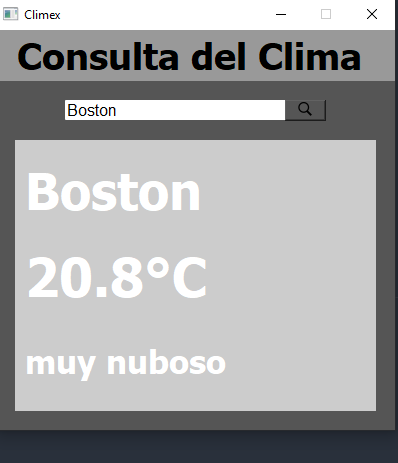

# Consultar el Clima

### Herraminetas
* Python
* Pyside2
* QtDisainer
#
### Descripción 
La función de esta app es la consultar el clima gracias al uso de la api del clima de una pagina, en el cuadro de texto tu escribes la ciudad, pulsas el boton y despues aparece la información del clima, las cuales son nombre de la ciudad, temperatura, y descripción.
#
### Código
El archivo clima.ui y ui_clima.py son derivados de la interfaz grafica en Qtdisainer, el archivo core es para arrancar el progrma solo desde ese archivo, el archivo main contiene la logica del programa
#
### Imagenes de Muestra

